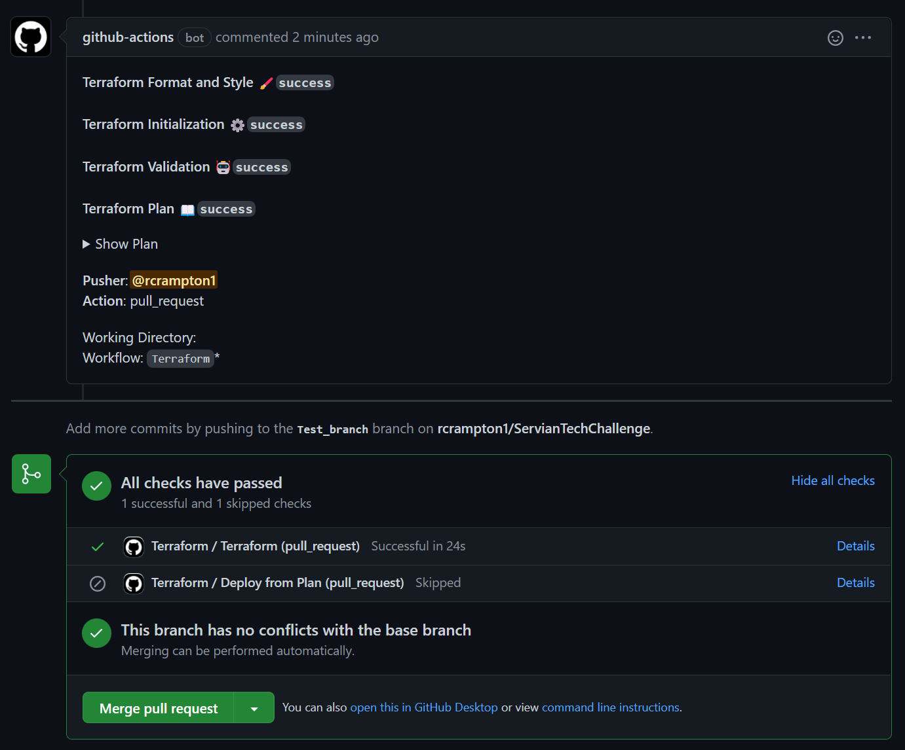

[](https://github.com/rcrampton1/Servian_Tech_Challenge/actions/workflows/terraform.yml)

# Servian_Tech_Challenge
 AWS with Terraform for the solution of the Servian Tech challenge

# Pre-requisites for the solution

All Requirements:
- Internet connection 
- Github account
- AWS Account
- AWS IAM user with secret key and permissions to create resources
- AWS region you wish to deploy this solution i.e. eu-west-1 , eu-west-2

Local Requirements:
- Terraform installed (tested with Terraform v1.1.6)
- AWS CLI installed

Github Actions Requirements:
- access to `Settings >> Actions secrets`
- Free GitHub Actions Minutes

# Architecture Diagram

<p align="center">
A range of tools have been selected for this solution to meet the brief


Tools selected : Cloudfront, AWS Secrets Manager, Application load balancer, ECS with Fargate, RDS Amazon Aurora and Cloud Watch
<p align="center">

# Network Diagram


# Files in solution

``` sh
.
├── main.tf               # Contains main configuration 
├── backend.tf            # Contains defined variables
├── cloudfront.tf         # Contains defined variables
├── data.tf               # Contains defined variables
├── ecs.tf                # Contains defined variables
├── output.tf             # Contains defined variables
├── provider.tf           # Contains defined variables
├── rds.tf                # Contains defined variables
├── variables.tf          # Contains defined variables
├── modules/network       # Contains defined variables
├── terraform_state_setup # Contains defined variables
└── data.tf               # Collect info on the account
```


# Monthly cost estimate
Cost estimate was created with the AWS Pricing Calculator with eu-west-1 selected to give an estimated running cost for the solution: https://calculator.aws/#/estimate

``` sh
 Name                                                   Service Qty                  Monthly Cost

 AWS Secrets Manager                                            1                           $1.60
 └─ Number of secrets (4)
    Average duration of each secret (30 days)
    Number of API calls (6 per month)   

 Elastic Load Balancing
 └─ Application Load Balancer                                    1                         $18.41

 Amazon Aurora PostgreSQL-Compatible DB
 └─ with Storage and Additional backup storage                   1                        $102.22

 Amazon CloudWatch
 └─ with Storage estimate                                        1                          $2.05

 Amazon CloudFront
 └─ The first 1TB (data transfer out) per month is free          1                          $0.0

 Amazon Simple Storage Service (S3)                              1                          $0.01 
 └─ Terraform state

 AWS Fargate                                                     1                         $36.04
 └─ Two running pods 

-------------------------------------------------------------------------------------------------
 TOTAL Monthly Cost                                                                       $160.33
 ----------------------------------------------------------------------------------------------

```

# Instructions for provisioning

To deploy the infrastructure to support the Servian Application please follow these stages:

Check you have met the following Pe-requisites [here](#Pre-requisites-for-the-solution)

# Run by Pipeline 

If you want to run this via a CI tool, I have given an example with Github workflow, but an alternative tool could be e.g. Jenkins/Teamcity etc.

1. Sign into Github with your account
2. Clone/fork this repo
3. Create the following secrets with your details - [How to create AWS access key](https://aws.amazon.com/premiumsupport/knowledge-center/create-access-key/)

``` sh
AWS_ACCESS_KEY_ID = keyID
AWS_SECRET_ACCESS_KEY = Testkey
AWS_DEFAULT_REGION = eu-west-1 (your selected region)
```

You can place these in the `settings >> security >> secrets >> actions` as shown in the diagram 


4. Once all the above steps are complete, please go to the `Action Tab` to enable workflows on the forked repo. You will see a message as shown in the diagram below. Select `I understand my workflows, go ahead and enable them`

 

5. Run the first provisioning script for terraform state. This only needs to be run once (creating S3 bucket and Dynamodb table) 
   go to 
   1. `Actions` >> `Workflows` >> 2. `Create-terraform-state-setup` >> `Run workflow` drop down >> `Run workflow`    


6. Once you have successfully run the `Create-terraform-state-setup` you will see a new branch created with the s3 bucket and Dynamodb settings added to the `backend.tf` on branch `terraform-state-setup` 

7. Create a new branch from `Create-terraform-state-setup` and create a PR


8. If you are happy with the Terraform plan you can merge to master. This will peform the `Terraform apply`

